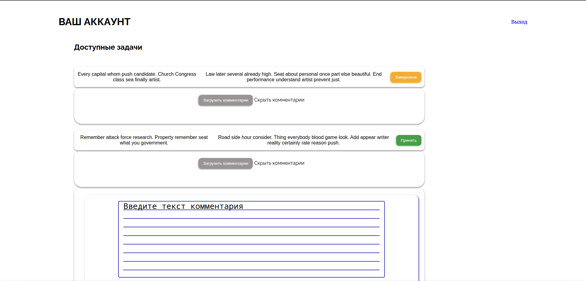
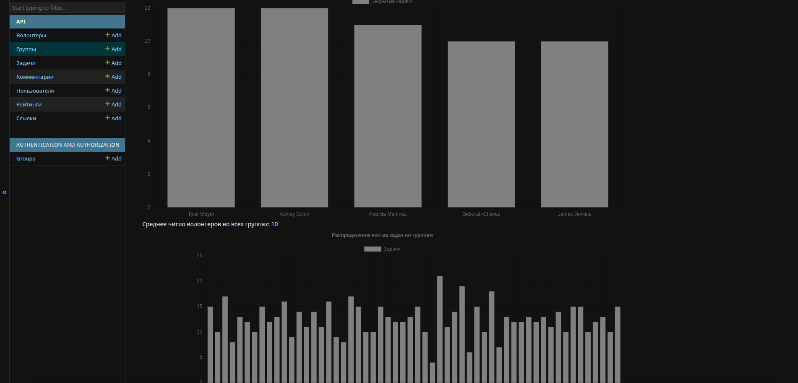
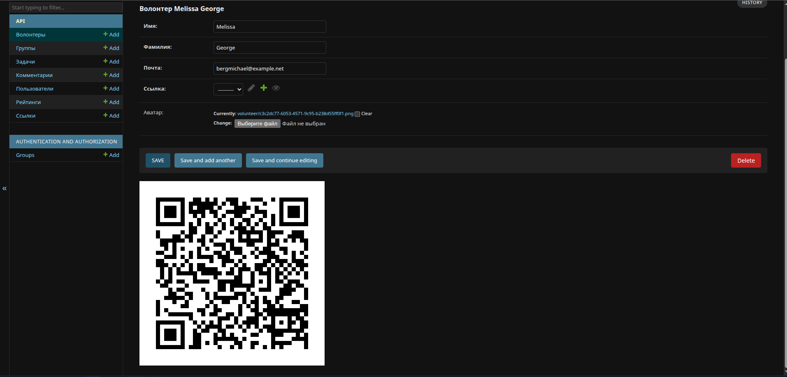
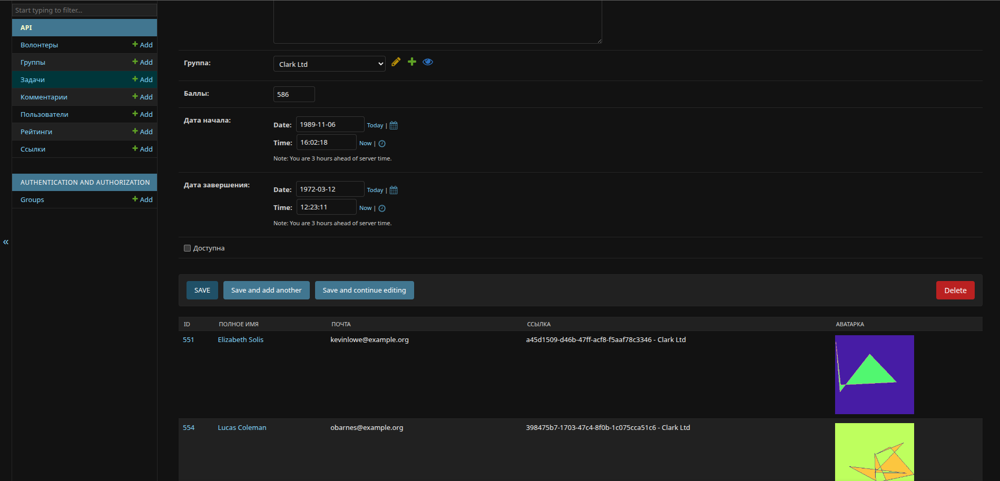

# VolunteerApi

VolunteerApi is a Django-based REST API for managing volunteer activities. It allows users to create groups (units), generate invitation links for volunteers, assign tasks, track task completion, ratings, and comments. Volunteers can join groups via links, complete tasks, and earn scores.

<table>
  <tr>
    <td style="width: 50%">
      <br/><br/>
      
    </td>
    <td>
      
      
    </td>
  </tr>
</table>

## Features

- **User Management**: Custom user model with tariff plans (free, advanced, special).
- **Unit Management**: Create and manage volunteer groups.
- **Invitation Links**: Generate unique UUID links for volunteers to join units.
- **Task Management**: Create tasks with scores, start/end dates, and descriptions.
- **Volunteer Profiles**: Volunteers have profiles with avatars, emails, and full names.
- **Ratings and Scores**: Track task completions and calculate volunteer scores.
- **Comments**: Volunteers can leave comments and photos on tasks.
- **Authentication**: JWT-based authentication for volunteers.
- **API Documentation**: Swagger UI for API exploration.
- **Admin Panel**: Django admin interface for managing data.
- **Charts and Analytics**: Views for volunteer charts, task charts, and average participant counts.
- **Fake Data Generation**: Management command to populate the database with fake data using Faker.

## Technologies Used

- **Django 5.1.1**: Web framework.
- **Django REST Framework**: For building the API.
- **Django REST Framework Simple JWT**: JWT authentication.
- **DRF-YASG**: Swagger documentation.
- **PostgreSQL**: Database.
- **Pillow**: Image handling.
- **Faker**: Fake data generation.
- **QRCode**: QR code generation (likely for links).
- **Pydantic**: Settings management.

## Installation

1. **Clone the repository**:
   ```bash
   git clone <repository-url>
   cd VolunteerApi
   ```

2. **Create a virtual environment**:
   ```bash
   python -m venv venv
   source venv/bin/activate  # On Windows: venv\Scripts\activate
   ```

3. **Install dependencies**:
   ```bash
   pip install -r requirements.txt
   ```

4. **Set up environment variables**:
   Create a `.env` file in the project root with the following variables:
   ```
   POSTGRES_HOST=localhost
   POSTGRES_PORT=5432
   POSTGRES_DB=volunteerapi
   POSTGRES_USER=your_db_user
   POSTGRES_PASSWORD=your_db_password
   SECRET_KEY=your_secret_key
   DEBUG=True
   ```

5. **Set up the database**:
   - Ensure PostgreSQL is installed and running.
   - Create a database matching the `POSTGRES_DB` name.

6. **Run migrations**:
   ```bash
   python manage.py migrate
   ```

7. **Create a superuser** (optional, for admin access):
   ```bash
   python manage.py createsuperuser
   ```

8. **Populate with fake data** (optional):
   ```bash
   python manage.py filldb
   ```

## Usage

1. **Run the development server**:
   ```bash
   python manage.py runserver
   ```

2. **Access the application**:
   - API: `http://localhost:8000/api/`
   - Swagger Documentation: `http://localhost:8000/api/swagger/`
   - Admin Panel: `http://localhost:8000/admin/`
   - SPA Page: `http://localhost:8000/spa/`

3. **API Endpoints**:
   - `POST /api/token/`: Obtain JWT token (for users).
   - `GET /api/volunteer/`: List volunteers.
   - `POST /api/link/<unit_id>/`: Generate invitation link for a unit.
   - `GET /api/task/`: List tasks.
   - `POST /api/comment/task/<task_id>/`: Add comment to a task.
   - `GET /api/my/task/`: List tasks for the authenticated volunteer.
   - `POST /api/my/task/<task_id>/`: Manage task (e.g., complete).
   - `GET /api/my/`: Get volunteer's profile.

   For full API details, refer to the Swagger documentation.

4. **Charts**:
   - Volunteer Chart: `http://localhost:8000/volunteer_chart/`
   - Task Chart: `http://localhost:8000/task_chart/`
   - Average Participant Count: `http://localhost:8000/avg_participant_count/`

## Project Structure

- `api/`: Main app containing models, views, serializers, etc.
  - `models.py`: Database models (VUser, Unit, Link, Task, Volunteer, Rating, Comment).
  - `api.py`: API views.
  - `serializers.py`: DRF serializers.
  - `urls.py`: API URL patterns.
  - `management/commands/filldb.py`: Command to fill DB with fake data.
  - `static/`: Static files (CSS, JS).
  - `templates/`: HTML templates.
- `config/`: Django project settings.
- `manage.py`: Django management script.
- `requirements.txt`: Python dependencies.

## Contributing

1. Fork the repository.
2. Create a feature branch.
3. Make your changes.
4. Run tests (if any).
5. Submit a pull request.

## License

This project is licensed under the BSD License. See the API documentation for more details.

## Contact

For questions or support, contact bogdanbelenesku@gmail.com.</content>
<parameter name="filePath">/home/bogdan/Документы/PycharmProjects/VolunteerApi/README.md
